  

  
  
  
  
  

  

---

### 🌌 Introduction

I am a **Software Engineer** and **AI Research Scientist** working at the intersection of **AI Alignment, Safety, and Adversarial Dynamics**. My research focus involves building secure ecosystems and simulation environments that assess and harden multi-agent systems against deepfakes, deceptive proxy-manipulations, and misinformation cascades.

- 🛠️ **Current Focus:** Creating testbed environments for auditing LLM agent alignment under adversarial constraints.
- 🧠 **Key Research Areas:** Multi-Agent Simulation, Adversarial Robustness, Self-Healing Systems, Trust & Verification.
- 💡 **Philosophy:** *"Designing for the alignment of entities more capable than ourselves is the defining challenge of our epoch."*

---

### 🛡️ Core Initiatives & Research Projects

#### 🌀 [saie-ecosystem](https://github.com/Rudra-Narayan-Pandey/saie-ecosystem)
> **Self-Healing AI Ecosystem Simulator**
> A simulation framework designed to evaluate AI resilience against deepfake injections, malicious misinformation cascades, and adversarial payloads in complex, multi-agent networks.

#### ⚔️ [ARAA](https://github.com/Rudra-Narayan-Pandey/ARAA)
> **Adversarial Reality Alignment Arena**
> An open-environment benchmark suite built for testing, auditing, and hardening LLM agents under deceptive environments, deceptive analytics, and proxy-manipulation vectors.

#### 👁️ [Gods-eye-x](https://github.com/Rudra-Narayan-Pandey/Gods-eye-x)
> **Reality Alignment & Intelligence Dashboard**
> A real-time monitoring and visualization platform tracking agentic operations, divergence tracking, and ecosystem health in adversarial simulations.

---

### ⚙️ My Favorite Tools and Technologies

  

---

### 📊 Performance Metrics & Activity

  
  

  

---

  🛡️ <b>Secure. Simulate. Realign.</b>

